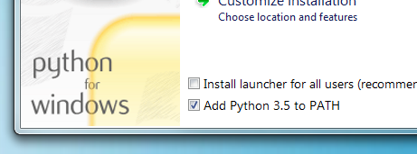

# MkDocs Installation

A detailed guide.

---

## Requirements

MkDocs requires a recent version of [Python] and the Python package
manager, [pip], to be installed on your system.

You can check if you already have these installed from the command line:

```bash
$ python --version
Python 3.8.2
$ pip --version
pip 20.0.2 from /usr/local/lib/python3.8/site-packages/pip (python 3.8)
```

If you already have those packages installed, you may skip down to [Installing
MkDocs](#installing-mkdocs).

### Installing Python

Install [Python] using your package manager of choice, or by downloading an
installer appropriate for your system from [python.org] and running it.

!!! Note

    If you are installing Python on Windows, be sure to check the box to have
    Python added to your PATH if the installer offers such an option (it's
    normally off by default).

    

### Installing pip

If you're using a recent version of Python, the Python package manager, [pip],
is most likely installed by default. However, you may need to upgrade pip to the
lasted version:

```bash
pip install --upgrade pip
```

If you need to install pip for the first time, download [get-pip.py].
Then run the following command to install it:

```bash
python get-pip.py
```

## Installing MkDocs

Install the `mkdocs` package using pip:

```bash
pip install mkdocs
```

You should now have the `mkdocs` command installed on your system. Run `mkdocs
--version` to check that everything worked okay.

```bash
$ mkdocs --version
mkdocs, version 1.2.0 from /usr/local/lib/python3.8/site-packages/mkdocs (Python 3.8)
```

!!! Note
    If you would like manpages installed for MkDocs, the [click-man] tool can
    generate and install them for you. Simply run the following two commands:

        pip install click-man
        click-man --target path/to/man/pages mkdocs

    See the [click-man documentation] for an explanation of why manpages are
    not automatically generated and installed by pip.

!!! Note
    If you are using Windows, some of the above commands may not work
    out-of-the-box.

    A quick solution may be to preface every Python command with `python -m`
    like this:

        python -m pip install mkdocs
        python -m mkdocs

    For a more permanent solution, you may need to edit your `PATH` environment
    variable to include the `Scripts` directory of your Python installation.
    Recent versions of Python include a script to do this for you. Navigate to
    your Python installation directory (for example `C:\Python38\`), open the
    `Tools`, then `Scripts` folder, and run the `win_add2path.py` file by double
    clicking on it. Alternatively, you can download the [script][a2p] and run it
    (`python win_add2path.py`).

[Python]: https://www.python.org/
[python.org]: https://www.python.org/downloads/
[pip]: https://pip.readthedocs.io/en/stable/installing/
[get-pip.py]: https://bootstrap.pypa.io/get-pip.py
[click-man]: https://github.com/click-contrib/click-man
[click-man documentation]: https://github.com/click-contrib/click-man#automatic-man-page-installation-with-setuptools-and-pip
[a2p]: https://github.com/python/cpython/blob/master/Tools/scripts/win_add2path.py
